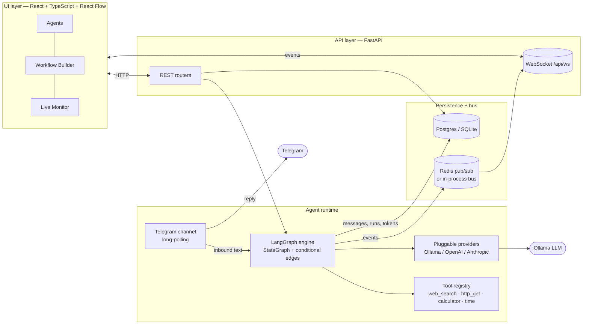

# AgentLeague — AI Agent Orchestration Platform

> Create AI agents, configure how they behave, wire them into collaborative
> multi-agent workflows with conditions and feedback loops, run them on a **real
> LangGraph runtime** with **real tools**, talk to an agent live over **Telegram**,
> and watch everything in a real-time monitoring UI.

Built for the Yuno *AI Agent Orchestration Platform* challenge. Runs fully local
with a single command.

---

## 1. What it does

- **Agent CRUD + deep configuration** — name, role, system prompt, provider/model,
  temperature, tools, channels, skills, **memory**, **schedule**, **interaction
  rules**, and **guardrails** (max steps, blocked words).
- **Visual workflow builder** (React Flow) — drag agents onto a canvas, connect
  them, and put **conditions on edges** (`always`, `contains`, `not_contains`,
  `llm_route`). Backward edges create **feedback loops**, bounded by a per-node
  *max-visits* guard so loops always terminate.
- **Real runtime** — workflows compile to a **LangGraph** `StateGraph` and
  actually execute: each agent node runs a ReAct-style tool loop over a live LLM.
- **Asynchronous multi-agent execution** — runs happen in background tasks;
  agents hand off through shared graph state; every event is published on an
  async bus (Redis or in-process).
- **External messaging channels** — a human can hold a live conversation with an
  agent (or a whole workflow) through **Telegram** and **Slack** (both via
  polling / Socket Mode, so no public webhook is needed).
- **Live monitoring** — a WebSocket stream of node transitions, inter-agent
  messages, tool calls/results, errors, and **token + cost tracking**, plus a
  persisted, replayable message history.
- **2 pre-built templates** — *Research → Write → Edit* (with an editorial
  feedback loop) and *Customer Support Triage* (conditional routing, Telegram-facing).

---

## 2. Architecture

The system keeps a hard separation between the **UI layer**, the **agent runtime
integration**, and the **data/persistence layer** — as required.



**Layer responsibilities**

| Layer | Where | Responsibility |
|---|---|---|
| UI | `frontend/` | Manage agents/workflows visually, build graphs, stream live monitoring. Talks only to the API. |
| Runtime integration | `backend/app/runtime`, `backend/app/channels` | Compile + execute workflows on LangGraph, run tools, talk to LLMs and Telegram. Knows nothing about HTTP. |
| Persistence + bus | `backend/app/models`, `backend/app/core` | Store agents/workflows/runs/messages; fan out monitoring events. |
| Glue | `backend/app/services`, `backend/app/api` | Services orchestrate runtime ↔ persistence; routers expose them over HTTP/WS. |

The runtime never imports FastAPI, and the API never imports LangGraph directly —
they meet only in the thin `services` layer (notably `run_service`, which owns the
seam between an HTTP request and a background graph execution).

---

## 3. Tech stack & key decisions

| Choice | What | Why |
|---|---|---|
| **Language: Python (backend)** | FastAPI + asyncio | The agent/LLM ecosystem (LangGraph, LangChain, provider SDKs) is Python-native; async fits I/O-bound LLM + tool calls and powers the WebSocket monitor. |
| **Runtime: LangGraph** | `StateGraph` with conditional edges | A workflow here **is** a directed graph with conditions and cycles — exactly LangGraph's model. Conditions → `add_conditional_edges`; feedback loops → backward edges; async execution + token usage are first-class. CrewAI/AutoGen are more "agent-team" oriented and weaker at *explicit, visual, conditional graphs with loops*, which is the heart of this challenge. |
| **LLM: pluggable (Ollama / OpenAI-compatible / Anthropic)** | `langchain-ollama`, `langchain-openai` | Fully local via Ollama by default (zero key, satisfies "runs fully local"). The same provider layer drives **any OpenAI-compatible gateway** (hosted vLLM, a remote Qwen endpoint, real OpenAI) via `OPENAI_BASE_URL` + `OPENAI_API_KEY`, and Anthropic. The agent editor **discovers installed models live** from the active provider (`/api/tags` for Ollama, `/v1/models` for OpenAI-compatible) so you pick from real models, not a hardcoded list. |
| **Channels: Telegram + Slack** | `python-telegram-bot` (long-polling), `slack-bolt` (Socket Mode) | Both run locally with **no public webhook/tunnel** — keeping the "single command, fully local" promise. They share one `Channel` interface and one inbound router, so adding WhatsApp is purely additive. |
| **Persistence: Postgres (SQLite fallback)** | async SQLAlchemy | Postgres in Docker; SQLite when running bare so there's truly zero setup. Rich config (guardrails, memory, the workflow graph) is stored as JSON so configurable dimensions evolve without migrations. |
| **Bus: Redis (in-process fallback)** | pub/sub | Cross-process live monitoring in Docker; an in-process asyncio bus when Redis isn't configured. |
| **Frontend: React + TS + React Flow** | Vite, TanStack Query | React Flow is purpose-built for node/edge graph editing — ideal for the visual builder. TypeScript mirrors the backend schema for safety. |

---

## 4. Quick start (single command)

**Prerequisites:** Docker + Docker Compose. (First run downloads the Ollama model
`qwen2.5`, ~4.7 GB — one time.)

```bash
docker compose up --build
```

That brings up Postgres, Redis, Ollama (+ auto-pulls the model), the backend, and
the frontend. Then open:

- **Web UI:** http://localhost:5173
- **API docs:** http://localhost:8000/docs

**Your first end-to-end run (≈1 minute):**
1. Open the UI → **Dashboard**.
2. Click **Use template →** on *Research & Write (with feedback loop)*. This
   creates 3 agents and opens the workflow in the builder.
3. Click **▶ Run**, accept the default task, and watch the graph light up —
   nodes activate in turn, the Editor may loop back to the Writer, and the live
   log shows inter-agent messages, tool calls, and token/cost.
4. Open **Live Monitor** or click the run to see the full conversation + totals.

> Lighter model? `OLLAMA_MODEL=llama3.2 docker compose up --build` (also tool-capable).

### Use a hosted / OpenAI-compatible model instead of Ollama

The platform is provider-agnostic. To point it at any OpenAI-compatible endpoint
(hosted vLLM, a remote Qwen gateway, real OpenAI), set these in `backend/.env`
(local) or your shell before `docker compose up`:

```bash
DEFAULT_PROVIDER=openai
DEFAULT_MODEL=qwen3.6_35b            # any model the endpoint serves
OPENAI_API_KEY=sk-...
OPENAI_BASE_URL=https://your-gateway/v1
OPENAI_TIMEOUT=180                   # reasoning models can be slow
```

New agents and instantiated templates then default to that provider/model, and
**Settings** + the agent editor list the endpoint's live models. (Running
locally this way needs no Ollama at all.)

---

## 5. Connect a messaging channel (live human ↔ agent chat)

Bind either channel to an existing agent or workflow from the UI → **Settings →
Messaging channels** (or the **Channels** page). The most recent enabled binding
per channel receives inbound messages; with no binding the channel replies
"not connected". Bindings can also be pinned via `.env`
(`TELEGRAM_AGENT_ID`/`TELEGRAM_WORKFLOW_ID`, `SLACK_AGENT_ID`/`SLACK_WORKFLOW_ID`).

### Telegram
1. Message **@BotFather** → `/newbot` → copy the token.
2. Set it and restart: `TELEGRAM_BOT_TOKEN=123456:ABC... docker compose up --build`.
3. In **Settings → Messaging channels**, bind Telegram to the *Customer Support
   Triage* workflow (instantiate it first) or any agent. Message the bot.

### Slack (Socket Mode — no public URL)
1. Create an app at **api.slack.com/apps**. Enable **Socket Mode** and generate an
   app-level token (`xapp-…`, scope `connections:write`).
2. Add bot scopes `app_mentions:read`, `chat:write`, `im:history`, `im:read`;
   install to the workspace and copy the bot token (`xoxb-…`).
3. Set both and restart:
   ```bash
   SLACK_BOT_TOKEN=xoxb-... SLACK_APP_TOKEN=xapp-... docker compose up --build
   ```
4. Bind Slack to an agent/workflow in **Settings**, then DM the bot or @-mention it
   in a channel it's been invited to.

Either way, replies come from the runtime; conversations are persisted, visible in
the UI, and stream into **Live Monitor**.

---

## 6. Local development (without Docker)

You need a local **Ollama** (`ollama serve` + `ollama pull qwen2.5`). Postgres/Redis
are optional — it falls back to SQLite + an in-process bus.

```bash
# Backend
cd backend
python -m venv .venv && .venv/Scripts/pip install -r requirements.txt   # Windows
# source .venv/bin/activate && pip install -r requirements.txt          # macOS/Linux
uvicorn app.main:app --reload --port 8000

# Frontend (new terminal)
cd frontend
npm install
npm run dev        # http://localhost:5173, proxies /api to :8000
```

`make help` lists the same shortcuts.

---

## 7. Project structure

```
backend/
  app/
    core/         config · logging · async DB · event bus
    models/       SQLAlchemy ORM (Agent, Workflow, WorkflowRun, Message, …)
    schemas/      Pydantic API contracts
    runtime/      providers · tools · LangGraph engine · graph state   ← agent runtime
    channels/     Channel interface · Telegram adapter · inbound router ← messaging
    services/     agent/workflow/run/message orchestration             ← glue
    api/          REST routers + monitoring WebSocket
    templates/    pre-built workflow templates
  tests/          agent CRUD · workflow execution · feedback loop · channel delivery
frontend/
  src/
    api/          typed client + types
    hooks/        useMonitor (WebSocket)
    components/   AgentForm · AgentNode (React Flow) · Modal
    pages/        Dashboard · Agents · Workflows · Builder · Monitor · RunDetail · Channels
docker-compose.yml   one-command stack
```

---

## 8. How the runtime works

A stored workflow graph (`{nodes, edges}`) is compiled in
`runtime/engine.py:compile_workflow`:

- Each **agent node** becomes an async LangGraph node that builds the agent's LLM
  (per its provider/model/temperature), binds its tools, and runs a **ReAct loop**
  (call → execute tool calls → repeat) bounded by the agent's `max_steps` guardrail.
- **Edges** become a `add_conditional_edges` router per node. Specific conditions
  are evaluated before `always` (fallback), and a backward edge is **skipped once
  its target hits `max_visits`** — that's what makes feedback loops terminate.
- A global `MAX_WORKFLOW_STEPS` ceiling and LangGraph's `recursion_limit` are the
  final safety net.
- Every turn emits monitoring events and persists a `Message`; **token usage** is
  normalised across providers (`extract_usage`) and **cost** is computed from a
  per-model price table (`$0` for local models).

The HTTP layer only *creates* a run and schedules it; `run_service._execute` runs
the graph in a background task with its own DB session, so the request returns
immediately and the UI follows along over the WebSocket.

---

## 9. Tests

Critical paths are covered and run **fully offline** (a fake LLM replaces Ollama,
SQLite replaces Postgres):

```bash
cd backend && .venv/Scripts/python -m pytest -q     # 8 passed
```

- `test_agents.py` — agent creation / update / delete + runtime serialisation.
- `test_workflow_execution.py` — linear execution, **conditional branch
  selection**, and a **feedback loop that terminates** (Writer runs twice, then
  the Editor approves), plus token accounting.
- `test_channel_delivery.py` — inbound message routing to a bound agent, reply
  generation, and persisted/visible history.

---

## 10. Extending the platform

### Add a tool
In `backend/app/runtime/tools.py`, write a `@tool` function and add it to
`TOOL_REGISTRY`. It immediately appears in the agent editor and is bindable at runtime.

### Add a workflow template
In `backend/app/templates/builtin.py`, append a `TemplateSpec` (its agents, nodes,
and conditioned edges) to `TEMPLATES`. It becomes listable and one-click
instantiable in the UI — no other changes needed.

### Add a messaging channel (e.g. WhatsApp)
Telegram (`channels/telegram.py`) and Slack (`channels/slack.py`) are the two
reference implementations. To add another: implement the small `Channel`
interface in `channels/base.py` (`start`/`stop`), and inside your handler forward
inbound text to `channels/router.py:handle_inbound("<channel>", sender_id, text)`
— you get binding resolution, agent/workflow execution, reply generation, and
history persistence for free. Add a per-channel env fallback in
`router._ENV_FALLBACKS`, start it from the app lifespan like `start_slack`, and
expose it in `/api/channels/status`.

### Add an LLM provider
Add a branch in `runtime/providers.py:build_chat_model` returning a LangChain chat
model, list it in `list_providers`, and (optionally) add pricing to `PRICING`.
Agents can then select it per-agent.

---

## 11. Evaluation criteria → where to look

| Weight | Criterion | Where |
|---|---|---|
| 40% | Working end-to-end demo, 2+ agents on a real task | Template → builder **▶ Run**; Telegram live chat |
| 30% | Architecture & code quality | §2 layering; `runtime/` vs `services/` vs `api/`; tests |
| 20% | UI/UX & configurability | React Flow builder; full agent config form; live monitor |
| 10% | Documentation | this README + inline docstrings |

---

## 12. Notable tradeoffs

- **Telegram over WhatsApp** — WhatsApp's Meta onboarding + required public webhook
  conflict with "fully local, single command". Telegram's polling avoids both; the
  channel abstraction keeps WhatsApp/Slack additive.
- **Ollama default** — favors zero-cost, no-key local runs; cloud providers are one
  env var away thanks to the pluggable provider layer.
- **JSON config columns** — trades strict relational modelling for open-ended
  "configurable dimensions" without migration churn; Pydantic still validates at the edge.
- **In-process Telegram task** — simpler single-command boot than a separate worker,
  while the channel code stays cleanly isolated so it *could* be split out.
